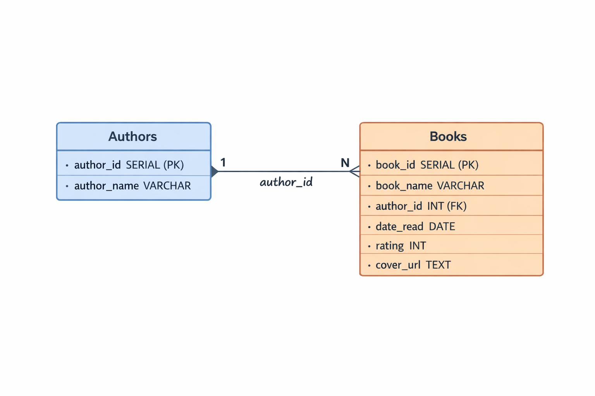
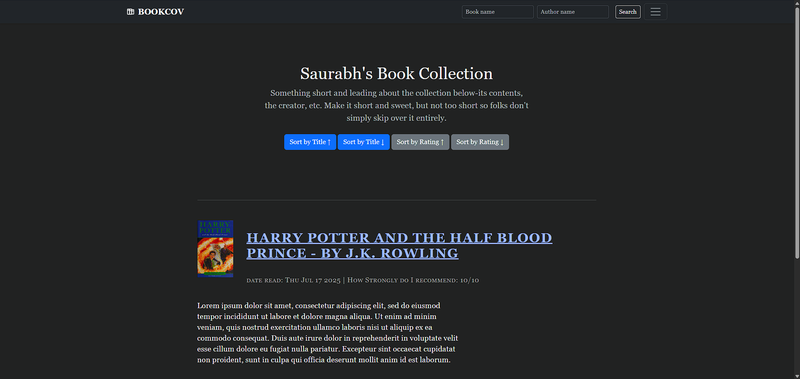
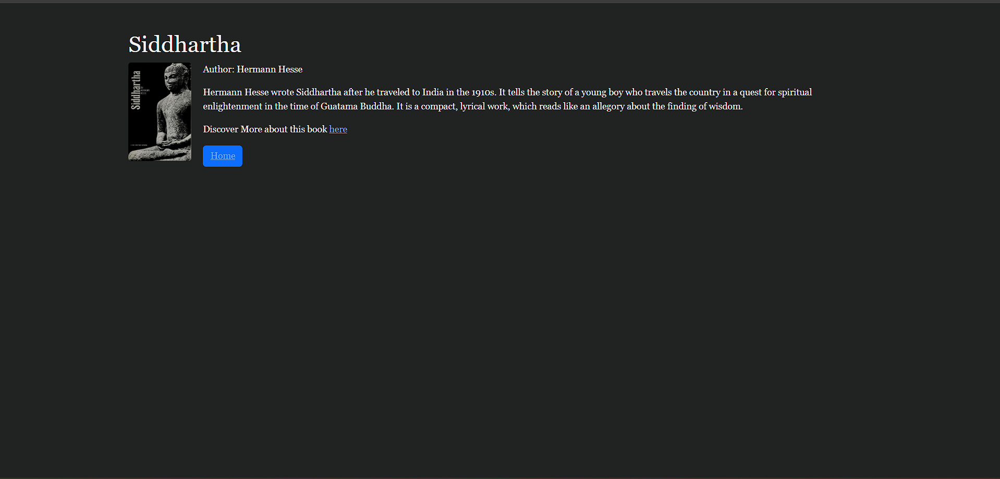
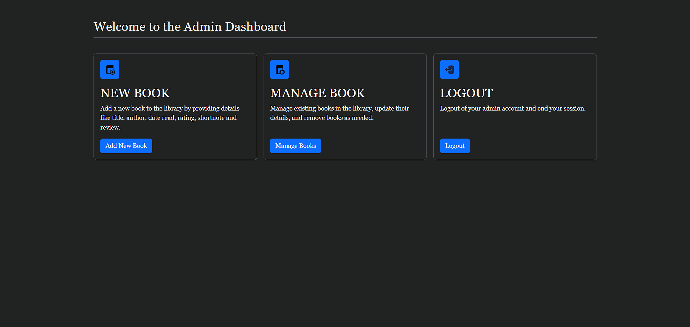
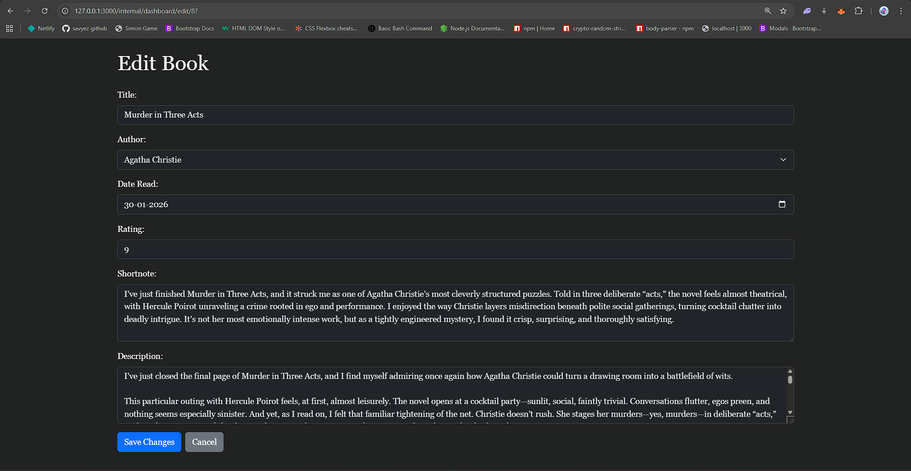
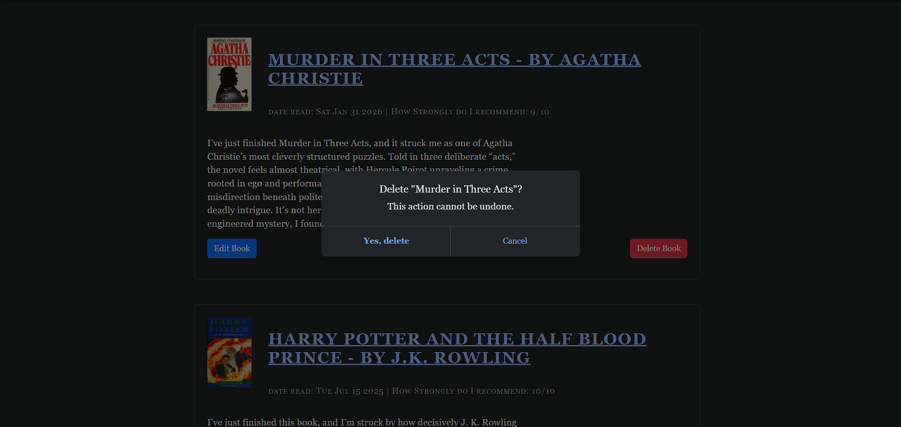

# BOOKCOV

BOOKCOV is a personal book-tracking web app built with Node.js, Express, EJS, and PostgreSQL.  
It lets you browse and sort your collection, search books via Open Library, and manage entries from an admin dashboard.

## Repo Description

Personal book collection manager with Open Library integration, admin dashboard, and PostgreSQL-backed CRUD.

## What This Project Does

- Displays your book collection on the home page
- Supports sorting by title and rating
- Shows detailed book pages
- Searches Open Library for book info
- Provides admin-only dashboard pages to:
- add books
- manage books
- edit books
- delete books (with modal confirmation)

## Tech Stack

- Node.js (ES Modules)
- Express 5
- EJS templating
- PostgreSQL (`pg`)
- Axios
- dotenv
- body-parser
- Bootstrap (UI)

## Project Structure

- `index.js` - server entry point and all routes
- `views/` - EJS templates (`index`, `book`, `search`, `login`, `internal-dashboard`, `new`, `manage`, `edit`)
- `views/partials/` - shared header/footer
- `public/` - static styles and image assets
- `db-schema.png` - database schema diagram

## Prerequisites

- Node.js 18+
- npm
- PostgreSQL 14+

## Environment Variables

Create a `.env` file in the project root:

```env
APP_PORT=3000

DB_HOST=localhost
DB_PORT=5432
DB_USER=postgres
DB_PASSWORD=your_password
DB_NAME=bookcov

BOOK_SEARCH_URL=https://openlibrary.org/search.json
ADMIN_USERNAME=admin
ADMIN_PASSWORD=change_me
```

## Installation

```bash
npm install
```

## Run Locally

```bash
node index.js
```

With nodemon:

```bash
npx nodemon index.js
```

Open in browser:

```text
http://127.0.0.1:3000
```

## Routes

### Public

| Method | Route | Purpose |
| --- | --- | --- |
| GET | `/` | Home page (books list) |
| GET | `/sort?by=title\|rating&order=asc\|desc` | Sorted list |
| GET | `/book/:book_id` | Single book details |
| GET | `/search` | Search page |
| POST | `/search` | Search Open Library and render result |

### Admin

| Method | Route | Purpose |
| --- | --- | --- |
| GET | `/internal/dashboard/login` | Login form |
| POST | `/internal/dashboard/login` | Login submit |
| GET | `/internal/dashboard` | Dashboard home |
| GET | `/internal/dashboard/new` | New book form |
| POST | `/internal/dashboard/new` | Create book/author |
| GET | `/internal/dashboard/manage` | Manage list |
| GET | `/internal/dashboard/edit/:book_id` | Edit form |
| POST | `/internal/dashboard/edit/:book_id` | Update book |
| POST | `/internal/dashboard/delete/:book_id` | Delete book |
| GET | `/internal/dashboard/logout` | Logout |

## Database Schema



## Screenshots

Add project screenshots to `./screenshots/` using these file names:

- `home.png`
- `search-result.png`
- `admin-dashboard.png`
- `manage-books.png`
- `edit-book.png`
- `delete-modal.png`

### Home


### Search Result


### Admin Dashboard


### Manage Books


### Edit Book


### Delete Confirmation Modal


## Notes

- Admin auth currently uses an in-memory boolean (`isLoggedIn`) and is not session-based.
- `coverUrl` is a shared variable in server memory and could be overwritten by concurrent requests.
- No automated tests are configured yet.

## Future Improvements

- Replace `isLoggedIn` with session-based auth (`express-session`) and secure cookies.
- Add role-based access control and route-level authorization middleware.
- Add input validation/sanitization with `zod` or `express-validator`.
- Add CSRF protection for admin POST routes.
- Refactor shared mutable globals (`authors`, `books`, `coverUrl`) into request-scoped logic.
- Add pagination on `/` and `/internal/dashboard/manage` for large datasets.
- Add filtering/search on manage page (title, author, rating, date).
- Improve error UX with user-friendly error pages and flash messages.
- Add unit/integration tests (route tests + DB integration tests).
- Add npm scripts (`start`, `dev`, `test`) and a lint/format setup.
- Add migrations (for example with `node-pg-migrate`) instead of manual schema changes.
- Add Docker support (`Dockerfile` + `docker-compose`) for app + Postgres.
- Add logging and monitoring (`pino`, request IDs, healthcheck endpoint).

## Repository

- GitHub: <https://github.com/savyez/Bookcov>
